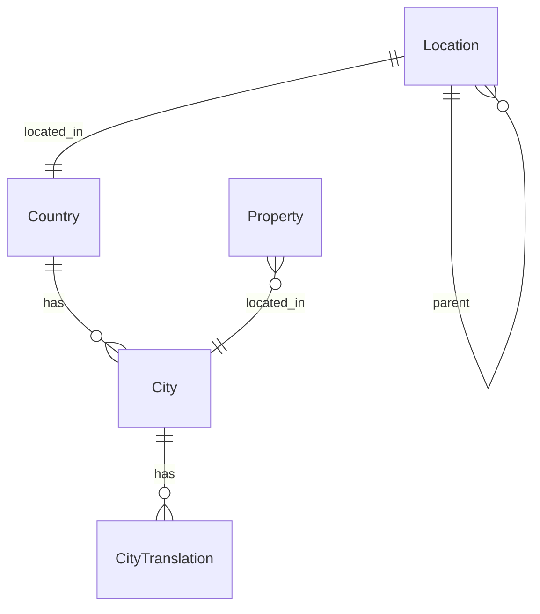

# Apps with the project

1. Core
2. Properties
3. [Locations](#locations)
4. Favorites
5. Users

---

## Locations

### **Architecture & Design Description for `locations` App**

#### 🧱 Purpose

The `locations` app is a centralized module to manage all geographic and administrative data used across the project, including:

* ISO-compliant **countries**
* Multi-language **cities**
* Flexible **location hierarchy** (region, municipality, area, street)
* Optional support for **geospatial data** (latitude, longitude)

This structure supports faceted search, clean user input (dropdowns), internationalization, and geospatial search in a scalable way.

---

### 🗺️ Model Diagram



---

### 🧩 Example Models (Simplified)

```python
class Country(models.Model):
    code = models.CharField(max_length=2, unique=True)  # ISO 3166-1 alpha-2
    name = models.CharField(max_length=255)
    native_name = models.CharField(max_length=255)

class City(models.Model):
    name = models.CharField(max_length=255)  # native name
    country = models.ForeignKey(Country, on_delete=models.CASCADE)
    latitude = models.FloatField()
    longitude = models.FloatField()

class CityTranslation(models.Model):
    city = models.ForeignKey(City, on_delete=models.CASCADE, related_name='translations')
    language = models.CharField(max_length=10)
    translated_name = models.CharField(max_length=255)

class Location(models.Model):
    name = models.CharField(max_length=255)
    type = models.CharField(max_length=50)  # e.g. "region", "municipality", "area", "street"
    parent = models.ForeignKey("self", null=True, blank=True, on_delete=models.CASCADE)
    country = models.ForeignKey(Country, on_delete=models.CASCADE)
```
