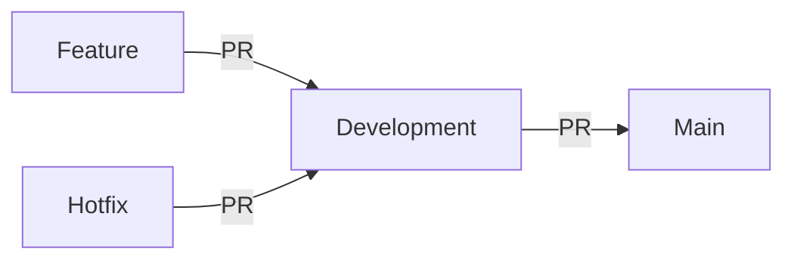

# Branch Management

## Overview
We follow a modified Git Flow approach with protected main and development branches.

## Branch Types

### 1. Main (`main`)
- Represents production-ready code
- Always deployable
- Protected - no direct pushes allowed
- Only updated via PRs from `development`

### 2. Development (`development`)
- Integration branch for features
- All PRs target this branch
- Must pass all CI checks before merging
- Source for releases to `main`

### 3. Feature Branches (`feature/*`)
- Created from `development`
- Named `feature/description` (e.g., `feature/user-auth`)
- Merged back to `development` via PR
- Should be short-lived (1-2 weeks max)

### 4. Hotfix Branches (`hotfix/*`)
- Created from `main` for critical fixes
- Merged to both `main` and `development`
- Follow same PR process as features

## Structure

## Merge Requirements
1. `main` is always protected
2. All changes require PR review
3. CI must pass before merge
4. Code review recommended
5. Branches deleted post-merge
6. Keep `development` stable at all times
